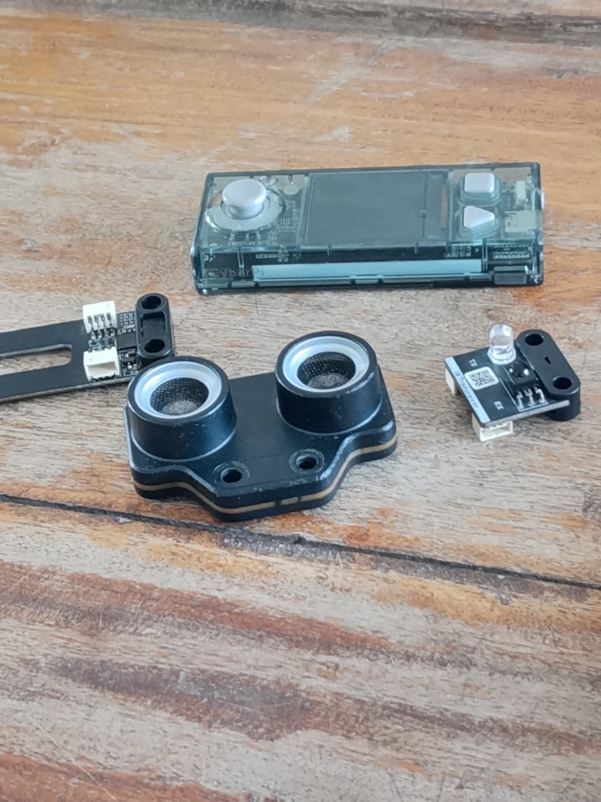
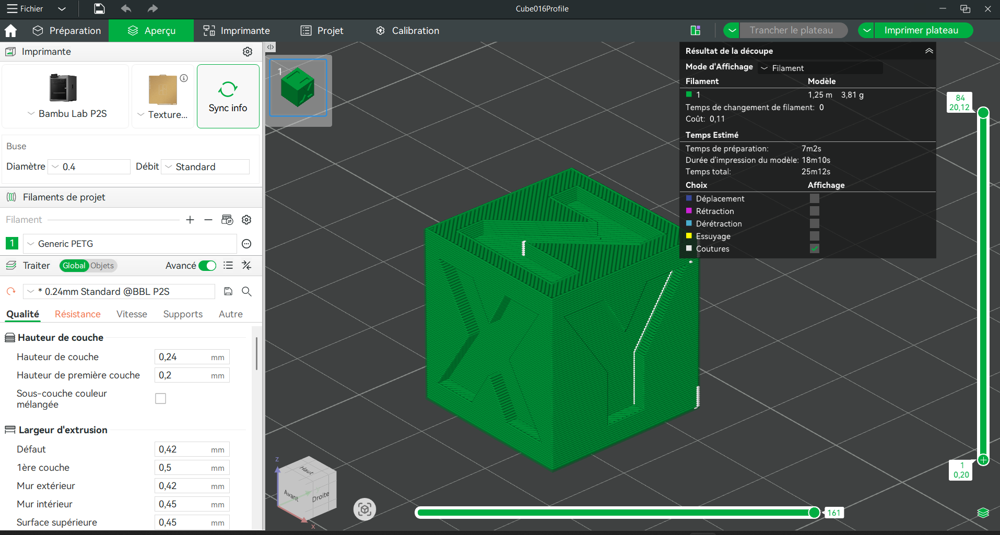
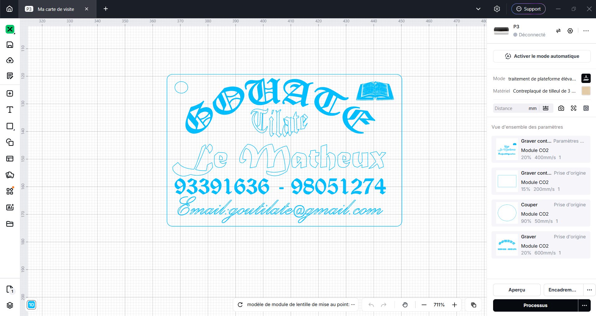

# JOURNAL DU 27 AOUT 2026
# Journal — Jeudi 27 août 2026 (rédigé par : Tilate GOUATE)

## Fait aujourd'hui

Contrôle de présence

Répartition de groupes

## Appris
**CyberPi et l'ecosystème mBuild**

Capteurs, actionneurs, projets pratiqyes et dimensionnement énergétique de la batteérie
Les entrées du CyberPi comme: Light sensor, Microphone, les Button A et B
J'ai egalement appri qu'un capteur mesure les grandeurs physique de l'environnement tels que: la distance, la lumière, la température, l'humidité du sol etc...
J'ai aussi appris qu'un actionnaire rçoit une commande et agit sur le monde physique (déplacer; éclairer; faire du bruit etc...)
J'ai aussi fait la connaissance de quelques capteurs: Les capteurs de son; de l'humidité, émetteur-récepteur, bouton poussoire  et un actionnaeur comme le ruban LED.
Ensuite on j'ai appris la programmation avec l'application  mBlock V5.6.0 ; programmer en Blocs un jeu de lumière avec CyberPi 

**Du modèle 3D au G-Code**
On a fait la pratique en concevant un modèle 3D avec Bambou Studio et l'imprimer  

J'ai également apprit la conception et l'impression d'une carte de visite avec XTool et le découper au laser 
## Raté, puis corrigé

- [J'ai raté un exercie donné par le formateur qui consistait à programmer en Blocs un jeu de lumière avec le CyberPi: Dès que le CyberPi démarre, une lumière s'allume, une seconde apres l'autre s'allumme et ainsi de suite jusqu'ç finir les 5 luùières et recommencer vers la fin en revenant avec le même sénario] → [J'ai pas su utiliser les évènément au bon moment] → [J'ai refait avec l'aide d'un ami] → [J'ai réussi]

## Décidé

- [Arbitrage rendu et son motif] → issue #NN fermée / BOM mise à jour

## À faire demain

- [Action] — Prénom
- [Action] — Prénom
