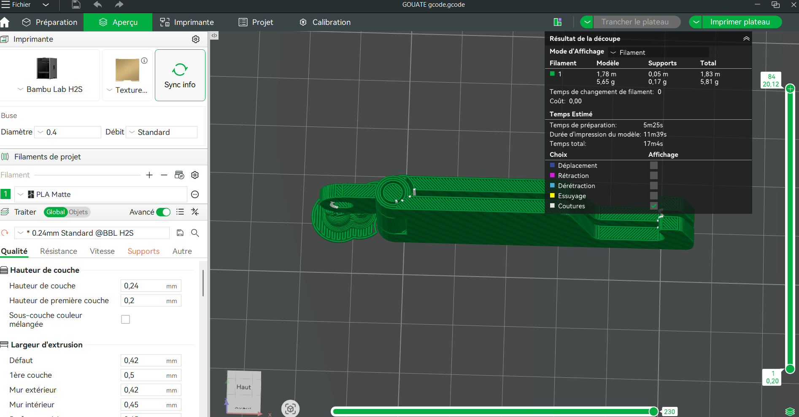

# JOURNAL DU 2026-08-28

# Journal — Vendredi 28 Août 2026 (rédigé par : Tilate GOUATE)

## Fait aujourd'hui

Contrôle de présence

Répartition de groupes

## Appris

**Electronique**

* Le codage avec mBlock. On a continué avec le codage d'hier mais de manière avancé. On a utilisé les capteurs de lumière et l'usage des contrôles et opérateurs dans le codage  

* Modélisation 3D avec Bambou Lab et impression avec les imprimantes P2S et H2S 

**LE DESIGNE THINKING ET MATHODE SPIRALE**

Le Design thinking est une méthode centrée sur l'utilisateur.
* Les différents étapes du design thinking:

>L'empathie: Récueillir la difficulté auprès de celui qui la vit.

La carte de l'empathie: 

1. Ce qu'il dit (Ces mots exacts)
2. Ce qu'il fait

3. Ce qu'il pense

4. Ce qu'il ressent 

>Definir: Formuler le problème en une phrase san la solution.

Definir = **l'usager a besoin de .... parce que .....**

>Idéer: Produire beaucoup puis trancher sur critères.
Idéer = Ouvrir largement et fermer explicitement

*Diverger - Produire (Laisser tout le monde donner son point de vu )*

*Convergence - Trancher (Préciser un peu plus mieux le contexte )*

>Protototyper: Représenter l'idéee au coup le plus bas coût.

1. Réprésentation

2. Le croquis coté

3. Le sénario d'usage

4. La fabrication vient après

>Tester: Observer un usage réel, se taire et noter

1. Donner une tâche; pas une explication

2. Se taire

3. La solution vient avant le problème

4. L'empathie imaginaire

5. L'idéation polie (Une idée qui est venue très vite n'est pas une bonne uidée)

6. Le croquis devenu plan.

# Conclusion

Les ateliers ont été très enrichissants. Ils m'ont permis de découvrir les machines et les techniques de fabrication numérique, de mieux comprendre le fonctionnement de l’impression 3D. J’ai compris qu’avant d’obtenir un objet physique, il faut suivre plusieurs étapes, allant de la conception du modèle numérique jusqu'à l'impression et éventuellement aux finitions. Ces connaissances constituent une base importante pour la suite de ma formation en FabLab et fabrication numérique.

